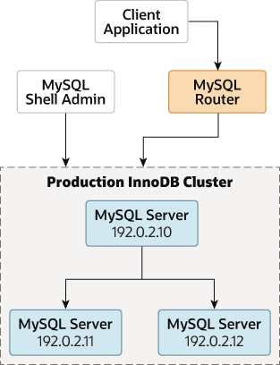

# 部署生产 InnoDB 集群

7.4.1 [预检查 InnoDB 集群使用的实例配置](#预先检查-innodb-集群使用的实例配置)
7.4.2 [为 InnoDB 集群使用配置生产实例](#为-innodb-集群使用配置生产实例)
7.4.3 [创建 InnoDB 集群](#创建-innodb-集群)
7.4.4 向 InnoDB 集群添加实例
7.4.5 配置 InnoDB 集群端口
7.4.6 将 MySQL 克隆与 InnoDB 集群一起使用
7.4.7 采用组复制部署

在生产环境中工作时，构成 InnoDB Cluster 的 MySQL 服务器实例作为网络的一部分在多台主机上运行，而不是在[第 6.8 节“AdminAPI MySQL 沙盒”](https://dev.mysql.com/doc/mysql-shell/8.0/en/admin-api-sandboxes.html)中描述的单台机器上运行。 在继续执行这些说明之前，您必须将所需的软件安装到您打算作为服务器实例添加到集群的每台机器上，请参阅[第 6.2 节，“安装 AdminAPI 软件组件”](https://dev.mysql.com/doc/mysql-shell/8.0/en/admin-api-installing-components.html)。

下图说明了您在本节中使用的场景：

图 7.2 生产部署


> 重要的
与沙盒部署不同，在沙盒部署中，所有实例都本地部署到 AdminAPI 可以访问本地文件并可以持久化配置更改的一台机器上，而对于生产部署，您必须持久化实例上的任何配置更改。 如何执行此操作取决于实例上运行的 MySQL 版本，请参阅[第 6.2.4 节，“持久设置”](https://dev.mysql.com/doc/mysql-shell/8.0/en/admin-api-persisting-settings.html)。

要将服务器的连接信息传递给 AdminAPI，请使用类似 URI 的连接字符串或数据字典； 请参阅[使用类似 URI 的字符串或键值对连接到服务器](https://dev.mysql.com/doc/refman/8.0/en/connecting-using-uri-or-key-value-pairs.html)。 在本文档中，显示了类似 URI 的字符串。

本节假设您有：

- 将 MySQL 组件安装到您的实例

- 安装 MySQL Shell 并可以通过[指定实例](https://dev.mysql.com/doc/mysql-shell/8.0/en/specifying-instances.html)进行连接

- 创建了[合适的管理用户](https://dev.mysql.com/doc/mysql-shell/8.0/en/creating-user-accounts-for-admin-api.html)

## 预先检查 InnoDB 集群使用的实例配置

在从服务器实例创建生产部署之前，您需要检查每个实例上的 MySQL 是否已正确配置。 dba.configureInstance() 函数将此作为配置实例的一部分，但您可以选择使用 dba.checkInstanceConfiguration(instance) 函数。 这将检查实例是否满足[第 7.1 节“InnoDB 集群要求”](https://dev.mysql.com/doc/mysql-shell/8.0/en/mysql-innodb-cluster-requirements.html)中列出的要求，而不更改实例上的任何配置。 这不会检查实例上的任何数据，有关更多信息，请参阅[检查实例状态](https://dev.mysql.com/doc/mysql-shell/8.0/en/add-instances-cluster.html#check-instance-state)。

您用于连接到实例的用户必须具有适当的权限，例如在[手动配置 InnoDB 集群管理员帐户](InnoDB集群的用户帐户.md#手动配置-innodb-集群管理员帐户)中配置的权限。 下面演示了在运行的 MySQL Shell 中发出这个：

```bash
mysql-js> dba.checkInstanceConfiguration('icadmin@ic-1:3306')
Please provide the password for 'icadmin@ic-1:3306': ***
Validating MySQL instance at ic-1:3306 for use in an InnoDB cluster...

This instance reports its own address as ic-1
Clients and other cluster members will communicate with it through this address by default.
If this is not correct, the report_host MySQL system variable should be changed.

Checking whether existing tables comply with Group Replication requirements...
No incompatible tables detected

Checking instance configuration...

Some configuration options need to be fixed:
+--------------------------+---------------+----------------+--------------------------------------------------+
| Variable                 | Current Value | Required Value | Note                                             |
+--------------------------+---------------+----------------+--------------------------------------------------+
| enforce_gtid_consistency | OFF           | ON             | Update read-only variable and restart the server |
| gtid_mode                | OFF           | ON             | Update read-only variable and restart the server |
| server_id                | 1             |                | Update read-only variable and restart the server |
+--------------------------+---------------+----------------+--------------------------------------------------+

Please use the dba.configureInstance() command to repair these issues.

{
    "config_errors": [
        {
            "action": "restart",
            "current": "OFF",
            "option": "enforce_gtid_consistency",
            "required": "ON"
        },
        {
            "action": "restart",
            "current": "OFF",
            "option": "gtid_mode",
            "required": "ON"
        },
        {
            "action": "restart",
            "current": "1",
            "option": "server_id",
            "required": ""
        }
    ],
    "status": "error"
}
```

对您计划用作集群一部分的每个服务器实例重复此过程。 运行 dba.checkInstanceConfiguration() 后生成的报告提供有关在 InnoDB Cluster 部署中使用实例所需的任何配置更改的信息。 报告的 config_error 部分中的操作字段告诉您实例上的 MySQL 是否需要重新启动以检测对配置文件所做的任何更改。

## 为 InnoDB 集群使用配置生产实例

AdminAPI 提供了 dba.configureInstance() 函数，该函数检查实例是否为 InnoDB Cluster 使用进行了适当的配置，并在发现任何与 InnoDB Cluster 不兼容的设置时配置该实例。您对一个实例运行 dba.configureInstance() 命令，它会检查使该实例可用于 InnoDB Cluster 所需的所有设置。如果实例不需要更改配置，则无需修改实例的配置，dba.configureInstance() 命令输出确认实例已准备好使用 InnoDB Cluster。

如果需要进行任何更改以使实例与 InnoDB Cluster 兼容，则会显示不兼容设置的报告，您可以选择让命令对实例的选项文件进行更改。根据 MySQL Shell 连接到实例的方式以及在实例上运行的 MySQL 版本，您可以通过将这些更改持久化到远程实例的选项文件来使这些更改永久化，请参阅[第 6.2.4 节，“持久化设置”](https://dev.mysql.com/doc/mysql-shell/8.0/en/admin-api-persisting-settings.html)。

不支持持久配置更改的实例自动要求您在本地配置实例，请参阅使用 dba.configureLocalInstance() [配置实例](https://dev.mysql.com/doc/mysql-shell/8.0/en/configuring-production-instances.html#configuring-local-instances)。或者，您可以手动更改实例的选项文件，有关更多信息，请参阅[使用选项文件](https://dev.mysql.com/doc/refman/8.0/en/option-files.html)。无论您以何种方式进行配置更改，都可能必须重新启动 MySQL 以确保检测到配置更改。

dba.configureInstance() 命令的语法是：
`dba.configureInstance([instance][, options])`
其中 instance 是一个实例定义，options 是一个数据字典，其中包含用于配置操作的附加选项。该操作返回有关结果的描述性文本消息。

实例定义是实例的连接数据。例如：
`dba.configureInstance('user@example:3306')`
有关更多信息，请参阅[使用类似 URI 的字符串或键值对连接到服务器](https://dev.mysql.com/doc/refman/8.0/en/connecting-using-uri-or-key-value-pairs.html)。如果目标实例已经属于 InnoDB Cluster，则会生成错误并且该过程会失败。

选项字典可以包含以下内容：

- mycnfPath - 实例的 MySQL 选项文件的路径。请注意，InnoDB Cluster 仅支持服务器实例的单个选项文件，不支持使用 --defaults-extra-file 选项指定附加选项文件。对于使用实例选项文件的任何 AdminAPI 操作，必须指定主文件。

- outputMycnfPath - 用于写入实例的 MySQL 选项文件的替代输出路径。

- password - 连接使用的密码。

- clusterAdmin - 要创建的 InnoDB Cluster 管理员用户的名称。支持的格式是标准的 MySQL 帐户名格式。支持用户名和主机名的标识符或字符串。默认情况下，如果不加引号，则假定输入是字符串。请参阅[第 6.4 节，“为 AdminAPI 创建用户帐户”](https://dev.mysql.com/doc/mysql-shell/8.0/en/creating-user-accounts-for-admin-api.html)。

- clusterAdminPassword - 使用 clusterAdmin 创建的 InnoDB Cluster 管理员帐户的密码。尽管您可以指定使用此选项，但这是一个潜在的安全风险。如果您未指定此选项，但指定了 clusterAdmin 选项，则会在交互式提示中提示您输入密码。

- clearReadOnly - 用于确认 super_read_only 应设置为 off 的布尔值，请参阅[超级只读模式下的实例配置](https://dev.mysql.com/doc/mysql-shell/8.0/en/configuring-production-instances.html#super-read-only-on-instance)。此选项已弃用，并计划在未来版本中删除。

- interactive - 一个布尔值，用于在命令执行中禁用交互式向导，因此不会向用户提供提示，也不会显示确认提示。

- restart - 一个布尔值，用于指示应执行目标实例的远程重启以完成操作。

虽然连接密码可以包含在实例定义中，但这是不安全的，不建议这样做。使用 MySQL Shell [第 4.4 节“可插入密码存储”](https://dev.mysql.com/doc/mysql-shell/8.0/en/mysql-shell-pluggable-password-store.html)安全地存储实例密码。

对实例发出 dba.configureInstance() 后，该命令会检查实例的设置是否适合 InnoDB Cluster 使用。将显示一个报告，其中显示 InnoDB Cluster 所需的设置。如果实例不需要对其设置进行任何更改，您可以在 InnoDB Cluster 中使用它，并且可以继续[第 7.4.3 节，“创建 InnoDB Cluster”](https://dev.mysql.com/doc/mysql-shell/8.0/en/create-cluster.html)。如果实例的设置对于 InnoDB Cluster 使用无效，则 dba.configureInstance() 命令会显示需要修改的设置。在配置实例之前，系统会提示您确认表格中显示的更改，并提供以下信息：

- 变量 - 无效的配置变量。

- 当前值 - 无效配置变量的当前值。

- 必需值 - 配置变量的必需值。

您如何进行取决于实例是否支持持久设置，请参阅[第 6.2.4 节，“持久设置”](https://dev.mysql.com/doc/mysql-shell/8.0/en/admin-api-persisting-settings.html)。当针对 MySQL Shell 当前运行的 MySQL 实例（即本地实例）发出 dba.configureInstance() 时，它会尝试自动配置该实例。当针对远程实例发出 dba.configureInstance() 时，如果该实例支持自动持久化配置更改，您可以选择这样做。如果远程实例不支持持久化更改以将其配置为 InnoDB Cluster 使用，则您必须在本地配置该实例。参阅[使用 dba.configureLocalInstance() 配置实例](#使用-dbaconfigurelocalinstance-配置实例)。

通常，在 dba.configureInstance() 配置选项文件后，不需要重新启动实例，但对于某些特定设置，可能需要重新启动。此信息显示在发出 dba.configureInstance() 后生成的报告中。如果实例支持 RESTART 语句，MySQL Shell 可以关闭然后启动实例。这可确保 mysqld 检测到对实例选项文件所做的更改。有关详细信息，请参阅[重新启动](https://dev.mysql.com/doc/refman/8.0/en/restart.html)。

> 笔记
执行 RESTART 语句后，与实例的当前连接丢失。 如果启用了自动重新连接，则在服务器重新启动后重新建立连接。 否则，必须手动重新建立连接。

dba.configureInstance() 方法验证是否有合适的用户可用于集群使用，该用户用于集群成员之间的连接，请参见[第 6.4 节，“为 AdminAPI 创建用户帐户”](https://dev.mysql.com/doc/mysql-shell/8.0/en/creating-user-accounts-for-admin-api.html)。

如果您未指定用户来管理集群，则在交互模式下，向导允许您选择以下选项之一：

- 为 root 用户启用远程连接，不建议在生产环境中使用
- 创建一个新用户
- 没有自动配置，这种情况下需要手动创建用户

> Tip
如果实例的 super_read_only=ON，那么您可能需要确认 AdminAPI 可以设置 super_read_only=OFF。 有关详细信息，请参阅[超级只读模式下的实例配置](https://dev.mysql.com/doc/mysql-shell/8.0/en/creating-user-accounts-for-admin-api.html)。

### 使用 dba.configureLocalInstance() 配置实例

不支持自动持久配置更改的实例（请参阅第 6.2.4 节，“持久设置”）要求您连接到服务器，运行 MySQL Shell，本地连接到实例并发出 dba.configureLocalInstance()。这使 MySQL Shell 能够在对远程实例运行以下命令后修改实例的选项文件：

- dba.configureInstance()
- dba.createCluster()
- Cluster.addInstance()
- Cluster.removeInstance()
- Cluster.rejoinInstance()

> 重要
未能将配置更改持久保存到实例的选项文件可能会导致实例在下次重新启动后无法重新加入集群。
实例的相关配置选项，尤其是 Group Replication 配置选项，必须位于单个选项文件中。 InnoDB Cluster 仅支持服务器实例的单个选项文件，不支持使用 --defaults-extra-file 选项指定附加选项文件。对于使用实例选项文件的任何 AdminAPI 操作，必须指定主文件。

持久化配置更改的推荐方法是登录远程机器，例如使用 SSH，以 root 用户身份运行 MySQL Shell，然后连接到本地 MySQL 服务器。例如，使用 --uri 选项连接到本地实例：
`$> sudo -i mysqlsh --uri=instance`
或者使用 \connect 命令登录到本地实例。然后发出 dba.configureInstance(instance)，其中 instance 是本地实例的连接信息，以持久保存对本地实例的选项文件所做的任何更改。
`mysql-js> dba.configureLocalInstance('icadmin@ic-2:3306')`
对集群中不支持自动持久化配置更改的每个实例重复此过程。例如，如果您向不支持自动持久化配置更改的集群添加 2 个实例，则必须连接到每个服务器并在实例重新启动之前持久化 InnoDB Cluster 所需的配置更改。同样，如果您修改集群结构，例如更改实例数量，则需要对每个服务器实例重复此过程，以相应地为集群中的每个实例更新 InnoDB Cluster 元数据。

### 超级只读模式下的实例配置

每当 Group Replication 停止时，[super_read_only](https://dev.mysql.com/doc/refman/8.0/en/server-system-variables.html#sysvar_super_read_only) 变量就会设置为 ON，以确保不会对实例进行写入。 当您尝试将此类实例与以下 AdminAPI 命令一起使用时，您可以选择在实例上设置 super_read_only=OFF：

- dba.configureInstance()
- dba.configureLocalInstance()
- dba.dropMetadataSchema()

当 AdminAPI 遇到 super_read_only=ON 的实例时，在交互模式下，您可以选择设置 super_read_only=OFF。 例如：

```bash
mysql-js> var myCluster = dba.dropMetadataSchema()
Are you sure you want to remove the Metadata? [y/N]: y
The MySQL instance at 'localhost:3310' currently has the super_read_only system
variable set to protect it from inadvertent updates from applications. You must
first unset it to be able to perform any changes to this instance.
For more information see:
https://dev.mysql.com/doc/refman/en/server-system-variables.html#sysvar_super_read_only.

Do you want to disable super_read_only and continue? [y/N]: y

Metadata Schema successfully removed.
```

显示实例的当前活动会话数。 您必须确保没有应用程序可以无意中写入实例。 通过回答 y，您确认 AdminAPI 可以写入实例。 如果列出的实例有多个打开的会话，请在允许 AdminAPI 设置 super_read_only=OFF 之前谨慎行事。

## 创建 InnoDB 集群

准备好实例后，使用 dba.createCluster() 函数创建集群，使用 MySQL Shell 连接到的实例作为集群的种子实例。 种子实例被复制到您添加到集群的其他实例，使它们成为种子实例的副本。 在此过程中，ic-1 实例用作种子。 当您发出 dba.createCluster(name) MySQL Shell 创建一个经典的 MySQL 协议会话到连接到 MySQL Shell 当前全局会话的服务器实例。 例如，要创建一个名为 testCluster 的集群并将返回的集群分配给一个名为 cluster 的变量：

```bash
mysql-js> var cluster = dba.createCluster('testCluster')
Validating instance at icadmin@ic-1:3306...
This instance reports its own address as ic-1
Instance configuration is suitable.
Creating InnoDB cluster 'testCluster' on 'icadmin@ic-1:3306'...
Adding Seed Instance...
Cluster successfully created. Use Cluster.addInstance() to add MySQL instances.
At least 3 instances are needed for the cluster to be able to withstand up to
one server failure.
```

这种将返回的集群分配给变量的模式使您能够使用集群对象的方法对集群执行进一步的操作。 返回的 Cluster 对象使用一个新的会话，独立于 MySQL Shell 的全局会话。 这确保了如果您更改 MySQL Shell 全局会话，集群对象将保持其与实例的会话。

为了能够管理集群，您必须确保您拥有具有所需权限的合适用户。 推荐的方法是创建一个管理用户。 如果您在配置实例时没有创建管理用户，请使用 Cluster.setupAdminAccount() 操作。 例如，要创建一个名为 icadmin 的用户，该用户可以管理分配给变量 cluster 的 InnoDB Cluster，请发出：

`mysql-js> cluster.setupAdminAccount("icadmin")`

有关 InnoDB Cluster 管理员帐户的更多信息，请参阅[手动配置 InnoDB Cluster 管理员帐户](https://dev.mysql.com/doc/mysql-shell/8.0/en/innodb-cluster-user-accounts.html#admin-api-configuring-users)。

dba.createCluster() 操作支持 MySQL Shell 的交互选项。 交互式打开时，在以下情况下会出现提示：

- 如果实例属于 Group Replication 组，并且未将 adaptFromGr: true 设置为选项，则会询问您是否要采用复制组。
- 如果 force: true 未设置为选项，则会要求您确认创建多主集群。

当您运行 dba.createCluster() 并通过运行 Cluster.addInstance() 将更多服务器实例添加到 InnoDB Cluster 时，以下错误将记录到 MySQL 服务器实例的错误日志中。 这些消息是无害的，并且与 AdminAPI 启动组复制的方式有关：

```log
2020-02-10T10:53:43.727246Z 12 [ERROR] [MY-011685] [Repl] Plugin
group_replication reported: 'The group name option is mandatory'
2020-02-10T10:53:43.727292Z 12 [ERROR] [MY-011660] [Repl] Plugin
group_replication reported: 'Unable to start Group Replication on boot'
```

> 笔记
如果您遇到与元数据不可访问相关的错误，您可能配置了环回网络接口。为了正确使用 InnoDB Cluster，请禁用环回接口。

要检查集群是否已创建，请使用集群实例的 status() 函数。请参阅[使用 Cluster.status() 检查集群的状态](https://dev.mysql.com/doc/mysql-shell/8.0/en/monitoring-innodb-cluster.html#check-innodb-cluster-status)。

> Tips
一旦服务器实例属于一个集群，重要的是只使用 MySQL Shell 和 AdminAPI 管理它们。不支持在实例添加到集群后手动更改组复制的配置。同样，不支持在使​​用 AdminAPI 配置实例后修改对 InnoDB Cluster 至关重要的服务器变量，例如 server_uuid。

当您使用 MySQL Shell 8.0.14 及更高版本创建集群时，您可以设置在将实例从集群中驱逐之前等待的时间量，例如当它们变得无法访问时。将 expelTimeout 选项传递给 dba.createCluster() 操作，该操作在种子实例上配置 [group_replication_member_expel_timeout](https://dev.mysql.com/doc/refman/8.0/en/group-replication-options.html#sysvar_group_replication_member_expel_timeout) 变量。 expelTimeout 选项可以采用 0 到 3600 范围内的整数值。所有运行 MySQL 服务器 8.0.13 及更高版本的实例被添加到配置了 expelTimeout 的集群中，将自动配置为与种子实例上配置的 expelTimeout 值相同.

有关可以传递给 dba.createCluster() 的其他选项的信息，请参阅[第 7.9 节，“修改或解散 InnoDB 集群”](https://dev.mysql.com/doc/mysql-shell/8.0/en/mysql-innodb-cluster-working-with-cluster.html)。

### InnoDB Cluster replicationAllowedHost

当您使用 MySQL Shell 8.0.28 及更高版本创建集群时，如果您有安全要求，即 AdminAPI 自动创建的所有帐户都具有严格的身份验证要求，您可以为 replicationAllowedHost 集群配置选项设置一个值。 replicationAllowedHost 选项意味着自动创建的所有帐户只能从允许的主机连接，使用严格的基于子网的过滤。以前，默认情况下，[由 InnoDB Cluster 创建的内部用户帐户](https://dev.mysql.com/doc/mysql-shell/8.0/en/innodb-cluster-user-accounts.html#mysql-innodb-cluster-users-created)可以从任何地方访问。

replicationAllowedHost 选项可以采用字符串值。例如，要创建一个名为 testCluster 的集群并将 replicationAllowedHost 选项设置为 192.0.2.0/24，请发出：

`mysql-js> dba.createCluster('testCluster', {replicationAllowedHost:'192.0.2.0/24'})`

### 配置通信堆栈

从 MySQL Shell 8.0.30 开始，InnoDB Cluster 支持 MySQL 8.0.27 中为 Group Replication 引入的 MySQL 通信堆栈。

选项communicationStack: XCOM|MYSQL 设置组复制系统变量[group_replication_communication_stack](https://dev.mysql.com/doc/refman/8.0/en/group-replication-options.html#sysvar_group_replication_communication_stack) 的值。

例如：
`mysql-js> dba.createCluster("testCluster", {communicationStack: "xcom"})`
MYSQL 通信堆栈是为 MySQL 8.0.27 或更高版本创建的所有新集群的默认设置。

有关详细信息，请参阅[第 7.5.9 节，“配置组复制通信堆栈”](https://dev.mysql.com/doc/mysql-shell/8.0/en/shell-admin-api-communication-stack.html)。
