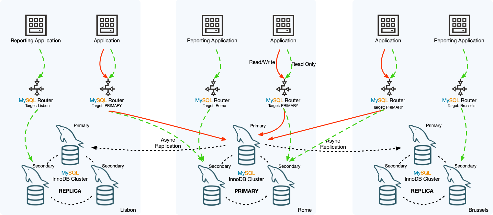

# MySQL InnoDB ClusterSet(集群集)

目录

8.1 InnoDB ClusterSet 要求
8.2 InnoDB ClusterSet 限制
8.3 InnoDB ClusterSet 的用户帐户
8.4 部署 InnoDB ClusterSet
8.5 将 MySQL 路由器与 InnoDB ClusterSet 集成
8.6 InnoDB ClusterSet 状态和拓扑
8.7 InnoDB ClusterSet 控制切换
8.8 InnoDB ClusterSet 紧急故障转移
8.9 InnoDB ClusterSet 修复和重新加入
8.10 升级 InnoDB ClusterSet

MySQL InnoDB ClusterSet 通过将主 InnoDB Cluster 与其在备用位置（例如不同的数据中心）中的一个或多个副本链接，为 InnoDB Cluster 部署提供容灾能力。 InnoDB ClusterSet 使用专用的 ClusterSet 复制通道自动管理从主集群到副本集群的复制。如果主集群由于数据中心丢失或与它的网络连接丢失而变得不可用，您可以激活副本集群来恢复服务的可用性。

InnoDB ClusterSet 部署中的主 InnoDB 集群和副本集群之间的紧急故障转移可以由管理员通过 MySQL Shell 触发，使用 AdminAPI ，它包含在 MySQL 外壳。您还可以在主集群仍然可用时执行从主集群到副本集群的受控切换，例如，如果主集群需要更改配置或维护。 MySQL 路由器 自动将客户端应用程序路由到 InnoDB ClusterSet 部署中的正确集群。

InnoDB ClusterSet 部署中的副本集群在保持被动副本时不能与主集群分离，因为它不接受写入。它可以被应用程序读取，尽管应该预料到异步复制的典型复制滞后量，因此数据可能还不完整。副本集群的最小大小是单个成员服务器实例，但为了容错，建议至少三个成员。如果需要更多成员，例如因为副本集群已通过切换或故障转移成为主集群，您可以随时通过 MySQL Shell 使用 AdminAPI 添加更多实例。在 InnoDB ClusterSet 部署中可以拥有的副本集群数量没有定义限制。

下图中的示例 InnoDB ClusterSet 部署包括位于罗马数据中心的主 InnoDB 集群，以及位于里斯本和布鲁塞尔数据中心的副本集群。主集群及其副本集群均由三个成员服务器实例组成，一个主服务器实例和两个辅助服务器实例。

图 8.1 InnoDB ClusterSet 概览 

三个 MySQL InnoDB Clusters 由三个 MySQL 服务器组成。两个集群是副本集群，一个是主集群。异步复制通道将主集群连接到每个副本集群。 MySQL 路由器将客户端应用程序连接到主集群以获取写入流量，并将客户端应用程序连接到主集群或副本集群以获取读取流量。

异步复制通道将事务从主集群复制到副本集群。在 InnoDB ClusterSet 创建过程中，每个集群上都会设置一个名为 clusterset_replication 的 ClusterSet 复制通道，当集群是副本时，它使用该通道从主节点复制事务。底层组复制技术管理通道并确保复制始终在主集群的主服务器（作为发送方）和副本集群的主服务器（作为接收方）之间进行。如果为主集群或副本集群选择了新的主集群，则会在它们之间自动重新建立 ClusterSet 复制通道。

尽管示例 InnoDB ClusterSet 部署中的每个集群都有一个主 MySQL 服务器，但只有主 InnoDB Cluster 的主服务器接受来自客户端应用程序的写入流量。副本集群没有。 MySQL 路由器实例将所有写入流量路由到罗马数据中心的主集群，由主服务器处理。大多数读取流量也被路由到主集群，但仅发出读取请求的报告应用程序被专门路由到其本地数据中心中的副本集群，以节省网络资源。请注意，处理读取和写入流量的 MySQL 路由器实例设置为将流量路由到 InnoDB ClusterSet 中的主 InnoDB Cluster，无论哪个是。因此，如果其他集群之一在受控切换或紧急故障转移后成为主集群，则这些 MySQL Router 实例会将流量路由到该集群。

重要的是要知道 InnoDB ClusterSet 优先考虑可用性而不是数据一致性，以最大限度地提高容灾能力。每个单独的 InnoDB Cluster 内的一致性由底层的 [Group Replication](https://dev.mysql.com/doc/refman/8.0/en/group-replication.html) 技术保证。但是，正常的复制滞后或网络分区可能意味着在主集群遇到问题时，部分或全部副本集群与主集群不完全一致。在这些情况下，如果您触发紧急故障转移，任何未复制或分歧的事务都有丢失的风险，并且只能手动恢复和协调（如果它们完全可以访问）。无法保证在发生紧急故障转移时会保留数据。

因此，在触发紧急故障转移之前，您应该始终尝试修复或重新连接主集群。 AdminAPI 消除了直接使用 Group Replication 来修复 InnoDB Cluster 的需要。如果主集群无法足够快地修复或无法到达，您可以继续紧急故障转移到副本 InnoDB 集群，以恢复应用程序的可用性。在受控切换过程中，确保数据一致性，并将原始主集群降级为工作只读副本集群。但是，在紧急故障转移过程中，数据的一致性并不能保证，因此为了安全起见，在故障转移过程中，原主集群被标记为失效。如果原始主集群保持在线状态，则应尽快将其关闭。

之后，您可以将失效的主集群重新加入 InnoDB ClusterSet 拓扑，前提是没有问题并且事务集与拓扑中的其他集群一致。检查、恢复和重新加入失效的主集群不会自动发生 - 管理员需要使用 AdminAPI 命令执行此操作。您可以选择修复失效的主集群并使其重新上线，也可以丢弃原来的主集群，继续使用新的主集群作为主集群，并创建新的副本集群。
