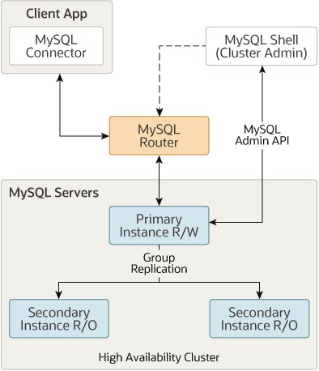

# InnoDB 集群

本章介绍 MySQL InnoDB Cluster，它结合了 MySQL 技术，使您能够为 MySQL 部署和管理一个完整的集成高可用性解决方案。此内容是 InnoDB Cluster 的高级概述，有关完整文档，请参阅 MySQL InnoDB Cluster。

> 重要的
InnoDB Cluster 不提供对 MySQL NDB Cluster 的支持。有关 MySQL NDB Cluster 的更多信息，请参阅[第 23 章，MySQL NDB Cluster 8.0](https://dev.mysql.com/doc/refman/8.0/en/mysql-cluster.html) 和[第 23.2.6 节，“使用 InnoDB 的 MySQL 服务器与 NDB Cluster 的比较”](https://dev.mysql.com/doc/refman/8.0/en/mysql-cluster-compared.html)。

一个 InnoDB Cluster 至少由三个 MySQL 服务器实例组成，它提供了高可用性和扩展特性。 InnoDB Cluster 使用以下 MySQL 技术：

- MySQL Shell，它是 MySQL 的高级客户端和代码编辑器。
- MySQL 服务器和组复制，它使一组 MySQL 实例能够提供高可用性。 InnoDB Cluster 提供了一种替代的、易于使用的编程方式来处理 Group Replication。
- MySQL Router，一个轻量级的中间件，在你的应用程序和 InnoDB Cluster 之间提供透明的路由。

下图概述了这些技术如何协同工作：

建立在 MySQL [Group Replication](https://dev.mysql.com/doc/refman/8.0/en/group-replication.html) 之上，提供了自动成员管理、容错、自动故障转移等功能。 InnoDB Cluster 通常以单主模式运行，具有一个主实例（读写）和多个辅助实例（只读）。高级用户还可以利用多主模式[multi-primary](https://dev.mysql.com/doc/refman/8.0/en/group-replication-multi-primary-mode.html)，其中所有实例都是主实例。您甚至可以在 InnoDB Cluster 在线时更改集群的拓扑，以确保尽可能高的可用性。

您使用作为 MySQL Shell 的一部分提供的 [AdminAPI](https://dev.mysql.com/doc/mysql-shell/8.0/en/admin-api-overview.html) 使用 InnoDB Cluster。 AdminAPI 在 JavaScript 和 Python 中可用，非常适合脚本和 MySQL 部署的自动化，以实现高可用性和可扩展性。通过使用 MySQL Shell 的 AdminAPI，您可以避免手动配置许多实例的需要。相反，AdminAPI 为 MySQL 实例集提供了一个有效的现代接口，使您能够从一个中央工具配置、管理和监控您的部署。

要开始使用 InnoDB Cluster，您需要[下载](https://dev.mysql.com/downloads/shell/)并[安装](https://dev.mysql.com/doc/mysql-shell/8.0/en/mysql-shell-install.html) MySQL Shell。你需要一些安装了 MySQL Server 实例的主机，你也可以[安装](https://dev.mysql.com/doc/mysql-router/8.0/en/mysql-router-installation.html) MySQL Router。

InnoDB Cluster 支持 [MySQL 克隆](https://dev.mysql.com/doc/refman/8.0/en/clone-plugin.html)，这使您能够简单地配置实例。过去，要在新实例加入一组 MySQL 实例之前配置它，您需要以某种方式手动将事务传输到加入实例。这可能涉及制作文件副本、手动复制它们等等。使用 InnoDB Cluster，您可以简单地向集群添加一个实例，它会自动配置。

同样，InnoDB Cluster 与 MySQL Router 紧密集成，您可以使用 AdminAPI 将它们一起使用。 MySQL Router 可以在称为引导的过程中基于 InnoDB Cluster 自动配置自身，这消除了您手动配置路由的需要。 MySQL Router 然后透明地将客户端应用程序连接到 InnoDB Cluster，为客户端连接提供路由和负载平衡。这种集成还使您能够管理使用 AdminAPI 针对 InnoDB 集群引导的 MySQL 路由器的某些方面。 InnoDB Cluster 状态信息包括有关针对集群引导的 MySQL 路由器的详细信息。操作使您能够在集群级别创建 MySQL 路由器用户，使用针对集群引导的 MySQL 路由器，等等。

有关这些技术的更多信息，请参阅描述中链接的用户文档。除了此用户文档之外，MySQL Shell JavaScript API 参考或 MySQL Shell Python API 参考中还有所有 AdminAPI 方法的开发人员文档，可从连接器和 API 获得。