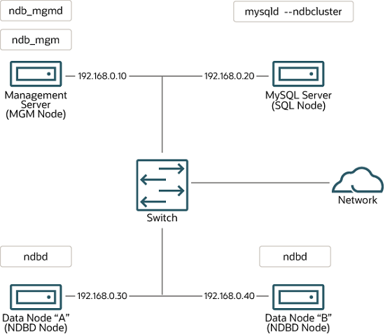

# NDB 集群安装

<https://dev.mysql.com/doc/refman/8.0/en/mysql-cluster-installation.html>

## 目录

[23.3.1 在 Linux 上安装 NDB 集群](在Linux上安装NDB集群.md)
[23.3.2 在 Windows 上安装 NDB Cluster](在Windows上安装NDB集群.md)
[23.3.3 NDB Cluster 的初始配置](NDB集群初始配置.md)
[23.3.4 NDB Cluster 的初始启动](NDB集群的初始启动.md)
23.3.5 带有表和数据的 NDB Cluster 示例
23.3.6 NDB Cluster 的安全关闭和重启
23.3.7 升级和降级 NDB 集群
23.3.8 NDB Cluster 自动安装程序（不再支持）

## 概述

本节介绍规划、安装、配置和运行 NDB Cluster 的基础知识。尽管[第 23.4 节“NDB Cluster 的配置”](https://dev.mysql.com/doc/refman/8.0/en/mysql-cluster-configuration.html)中的示例提供了有关各种集群选项和配置的更深入信息，但遵循此处概述的指南和过程的结果应该是一个可用的 NDB Cluster，它满足以下最低要求数据的可用性和保护。

有关在发布版本之间升级或降级 NDB Cluster 的信息，请参阅[第 23.3.7 节，“升级和降级 NDB Cluster”](https://dev.mysql.com/doc/refman/8.0/en/mysql-cluster-upgrade-downgrade.html)。

本节涵盖硬件和软件要求；网络问题；安装 NDB 集群；基本配置问题；启动、停止和重新启动集群；加载示例数据库；并执行查询。

### 安装节点主机

**假设**。以下部分对集群的物理和网络配置进行了一些假设。这些假设将在接下来的几段中讨论。

**集群节点和主机**。该集群由四个节点组成，每个节点位于单独的主机上，每个节点在典型的以太网网络上都有一个固定的网络地址，如下所示：

表 23.5 示例集群中节点的网络地址

| Node                   | IP Address    |
|------------------------|---------------|
| Management node (mgmd) | 198.51.100.10 |
| SQL node (mysqld)      | 198.51.100.20 |
| Data node "A" (ndbd)   | 198.51.100.30 |
| Data node "B" (ndbd)   | 198.51.100.40 |

图 23.4 NDB Cluster 多计算机设置


**网络寻址**。为简单起见（和可靠性），此操作指南仅使用数字 IP 地址。但是，如果您的网络上可以使用 DNS 解析，则可以在配置集群时使用主机名代替 IP 地址。或者，您可以使用 hosts 文件（通常是 Linux 和其他类 Unix 操作系统的 /etc/hosts，Windows 上的 C:\WINDOWS\system32\drivers\etc\hosts 或您的操作系统的等效文件）来提供一种方法如果可用，请进行主机查找。

在 NDB 8.0.22 之前，用于连接到数据和管理节点的所有网络地址都必须使用 IPv4 或可使用 IPv4 解析。这包括 SQL 节点用来联系其他节点的地址。从 NDB 8.0.22 开始，NDB Cluster 支持 IPv6 用于任何和所有集群节点之间的连接。

**潜在的主机文件问题**。由于某些操作系统（包括某些 Linux 发行版）在安装过程中在 /etc/hosts 中设置系统自己的主机名的方式，尝试为集群节点使用主机名时会出现一个常见问题。考虑两台主机名为 ndb1 和 ndb2 的机器，它们都在集群网络域中。 Red Hat Linux（包括一些衍生产品，例如 CentOS 和 Fedora）在这些机器的 /etc/hosts 文件中放置以下条目：

```bash
#  ndb1 /etc/hosts:
127.0.0.1   ndb1.cluster ndb1 localhost.localdomain localhost
```

```bash
#  ndb2 /etc/hosts:
127.0.0.1   ndb2.cluster ndb2 localhost.localdomain localhost
```

SUSE Linux（包括 OpenSUSE）将这些条目放在机器的 /etc/hosts 文件中：

```bash
#  ndb1 /etc/hosts:
127.0.0.1       localhost
127.0.0.2       ndb1.cluster ndb1
```

```bash
#  ndb2 /etc/hosts:
127.0.0.1       localhost
127.0.0.2       ndb2.cluster ndb2
```

在这两种情况下，ndb1 将 ndb1.cluster 路由到环回 IP 地址，但从 DNS 获取 ndb2.cluster 的公共 IP 地址，而 ndb2 将 ndb2.cluster 路由到环回地址并获取 ndb1.cluster 的公共地址。 结果是每个数据节点都连接到管理服务器，但无法判断任何其他数据节点何时连接，因此数据节点在启动时似乎挂起。

> **警告**
您不能在 config.ini 中混合使用 localhost 和其他主机名或 IP 地址。由于这些原因，这种情况下的解决方案（除了对所有 config.ini HostName 条目使用 IP 地址）是从 /etc/hosts 中删除完全限定的主机名，并在 config.ini 中为所有集群主机使用它们。

**主机类型**。在我们的安装方案中，每台主机都是基于 Intel 的台式 PC，运行支持的操作系统，以标准配置安装到磁盘上，并且不运行任何不必要的服务。具有标准 TCP/IP 网络功能的核心操作系统应该足够了。同样为了简单起见，我们还假设所有主机上的文件系统设置相同。如果不是，您应该相应地调整这些说明。

**网络硬件**。每台机器上都安装了标准的 100 Mbps 或 1 Gb 以太网卡，以及相应的卡驱动程序，并且所有四台主机都通过标准配置的以太网网络设备（如交换机）连接。 （所有机器都应该使用具有相同吞吐量的网卡。也就是说，集群中的所有四台机器都应该有 100 Mbps 的卡，或者所有四台机器都应该有 1 Gbps 的卡。）NDB Cluster 在 100 Mbps 网络中工作；但是，千兆以太网提供了更好的性能。

> **重要**
NDB Cluster 不适用于吞吐量低于 100 Mbps 或经历高度延迟的网络。出于这个原因（以及其他原因），尝试在 Internet 等广域网上运行 NDB Cluster 不太可能成功，并且在生产中不受支持。

**样本数据**。我们使用可从 MySQL 网站下载的世界数据库（参见 <https://dev.mysql.com/doc/index-other.html>）。我们假设每台机器都有足够的内存来运行操作系统、所需的 NDB Cluster 进程以及（在数据节点上）存储数据库。

有关安装 MySQL 的一般信息，请参阅[第 2 章，安装和升级 MySQL](https://dev.mysql.com/doc/refman/8.0/en/installing.html)。有关在 Linux 和其他类 Unix 操作系统上安装 NDB Cluster 的信息，请参阅[第 23.3.1 节，“在 Linux 上安装 NDB Cluster”](https://dev.mysql.com/doc/refman/8.0/en/mysql-cluster-install-linux.html)。有关在 Windows 操作系统上安装 NDB Cluster 的信息，请参阅[第 23.3.2 节，“在 Windows 上安装 NDB Cluster”](https://dev.mysql.com/doc/refman/8.0/en/mysql-cluster-install-windows.html)。

有关 NDB Cluster 硬件、软件和网络要求的一般信息，请参阅[NDB Cluster 硬件、软件和网络要求](../NDB集群概述/NDB资源要求.md)。
