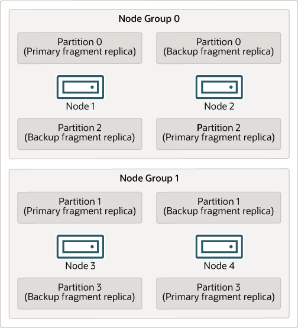
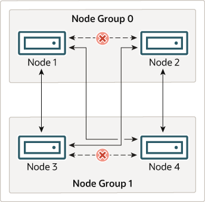

# NDB 集群节点、节点组、片段副本和分区

本节讨论 NDB Cluster 划分和复制数据以进行存储的方式。

在接下来的几段中将讨论一些对理解该主题至关重要的概念。

**Data node** 数据节点。 [ndbd](https://dev.mysql.com/doc/refman/8.0/en/mysql-cluster-programs-ndbd.html) 或 [ndbmtd](https://dev.mysql.com/doc/refman/8.0/en/mysql-cluster-programs-ndbmtd.html) 进程，它存储一个或多个片段副本，即分配给节点所属的节点组的分区的副本。

每个数据节点应位于单独的计算机上。虽然也可以在一台计算机上托管多个数据节点进程，但通常不推荐这种配置。

在提到 ndbd 或 ndbmtd 进程时，术语“节点”和“数据节点”通常可以互换使用；在提到的地方，管理节点（[ndb_mgmd](https://dev.mysql.com/doc/refman/8.0/en/mysql-cluster-programs-ndb-mgmd.html) 进程）和 SQL 节点（mysqld 进程）在本讨论中被指定为这样。

**Node group** 节点组。节点组由一个或多个节点组成，并存储分区或片段副本集。

NDB Cluster 中的节点组数量不能直接配置；它是数据节点数量和片段副本数量（NoOfReplicas 配置参数）的函数，如下所示：
`[# of node groups] = [# of data nodes] / NoOfReplicas`
因此，如果 NoOfReplicas 在 config.ini 文件中设置为 1，则具有 4 个数据节点的 NDB Cluster 具有 4 个节点组，如果 NoOfReplicas 设置为 2，则具有 2 个节点组，如果 NoOfReplicas 设置为 4，则具有 1 个节点组。片段副本是本节稍后讨论；有关 NoOfReplicas 的更多信息，请参阅[第 23.4.3.6 节，“定义 NDB Cluster 数据节点”](https://dev.mysql.com/doc/refman/8.0/en/mysql-cluster-ndbd-definition.html)。

> 笔记
NDB Cluster 中的所有节点组必须具有相同数量的数据节点。

您可以在线将新节点组（以及新数据节点）添加到正在运行的 NDB Cluster；有关更多信息，请参阅[第 23.6.7 节，“在线添加 NDB Cluster 数据节点”](https://dev.mysql.com/doc/refman/8.0/en/mysql-cluster-online-add-node.html)。

**Partition** 分割。这是集群存储的数据的一部分。每个节点负责保持分配给它的任何分区的至少一个副本（即至少一个片段副本）可用于集群。

NDB Cluster 默认使用的分区数取决于数据节点的数量和数据节点使用的 LDM 线程数，如下所示：
`[# of partitions] = [# of data nodes] * [# of LDM threads]`

使用运行 ndbmtd 的数据节点时，LDM 线程的数量由 MaxNoOfExecutionThreads 的设置控制。使用 ndbd 时有一个 LDM 线程，这意味着集群分区与参与集群的节点一样多。使用 ndbmtd 并将 MaxNoOfExecutionThreads 设置为 3 或更少时也是如此。 （您应该知道，LDM 线程的数量会随着此参数的值而增加，但不会以严格的线性方式增加，并且设置它还有其他限制；有关更多信息，请参阅 [MaxNoOfExecutionThreads](https://dev.mysql.com/doc/refman/8.0/en/mysql-cluster-ndbd-definition.html#ndbparam-ndbmtd-maxnoofexecutionthreads) 的描述。）

**NDB and user-defined partitioning** NDB 和用户定义的分区。 NDB Cluster 通常会自动对 NDBCLUSTER 表进行分区。但是，也可以对 NDBCLUSTER 表使用用户定义的分区。这受到以下限制：

1. 在 NDB 表的生产中仅支持 KEY 和 LINEAR KEY 分区方案。

2. 可以为任何 NDB 表显式定义的最大分区数为 `8 * [number of LDM threads] * [number of node groups]`，NDB Cluster 中的节点组数根据本节前面的讨论确定。为数据节点进程运行ndbd时，设置LDM线程数没有影响（因为ThreadConfig只适用于ndbmtd）；在这种情况下，可以将此值视为等于 1，以便执行此计算。
   有关更多信息，请参阅[第 23.5.3 节，“ndbmtd - NDB Cluster 数据节点守护程序（多线程）”](https://dev.mysql.com/doc/refman/8.0/en/mysql-cluster-programs-ndbmtd.html)。

有关 NDB Cluster 和用户定义分区的更多信息，请参阅[第 23.2.7 节，“NDB Cluster 的已知限制”](https://dev.mysql.com/doc/refman/8.0/en/mysql-cluster-limitations.html)和[第 24.6.2 节，“与存储引擎相关的分区限制”](https://dev.mysql.com/doc/refman/8.0/en/partitioning-limitations-storage-engines.html)。

**Fragment replica** 片段副本。这是集群分区的副本。节点组中的每个节点都存储一个片段副本。有时也称为分区副本。分片副本数等于每个节点组的节点数。

一个分片副本完全属于单个节点；一个节点可以（并且通常确实）存储多个片段副本。

下图说明了一个 NDB Cluster，其中有四个运行 ndbd 的数据节点，排列在两个节点组中，每个节点组有两个节点；节点 1 和 2 属于节点组 0，节点 3 和 4 属于节点组 1。

> 笔记
这里只显示数据节点；尽管一个正常工作的 NDB Cluster 需要一个 ndb_mgmd 进程来进行集群管理和至少一个 SQL 节点来访问集群存储的数据，但为了清楚起见，这些已经从图中省略了。

图 23.2 具有两个节点组的 NDB 集群

集群存储的数据分为四个分区，编号为 0、1、2 和 3。每个分区以多个副本的形式存储在同一个节点组上。分区存储在备用节点组上，如下所示：

分区 0 存储在节点组 0 上；主分片副本（主副本）存储在节点 1 上，备份分片副本（分区的备份副本）存储在节点 2 上。

分区 1 存储在另一个节点组（节点组 1）上；该分区的主分片副本在节点 3 上，其备份分片副本在节点 4 上。

分区 2 存储在节点组 0 上。但是，其两个分片副本的放置与分区 0 的放置相反；对于分区 2，主分片副本存储在节点 2 上，备份存储在节点 1 上。

分区 3 存储在节点组 1 上，其两个分片副本的放置与分区 1 的位置相反。即其主分片副本位于节点 4 上，备份位于节点 3 上。

对于 NDB Cluster 的持续运行，这意味着：只要参与集群的每个节点组至少有一个节点在运行，集群就拥有所有数据的完整副本并保持可用。这在下一张图中进行了说明。

图 23.3 2x2 NDB 集群所需的节点

在此示例中，集群由两个节点组组成，每个节点组由两个数据节点组成。每个数据节点都运行一个 ndbd 实例。来自节点组 0 的至少一个节点和来自节点组 1 的至少一个节点的任意组合足以使集群保持“活动”。但是，如果单个节点组中的两个节点都发生故障，则由另一个节点组中剩余的两个节点组成的组合是不够的。在这种情况下，集群丢失了整个分区，因此无法再提供对所有 NDB Cluster 数据的完整集的访问。

单个 NDB Cluster 实例支持的最大节点组数为 48。
