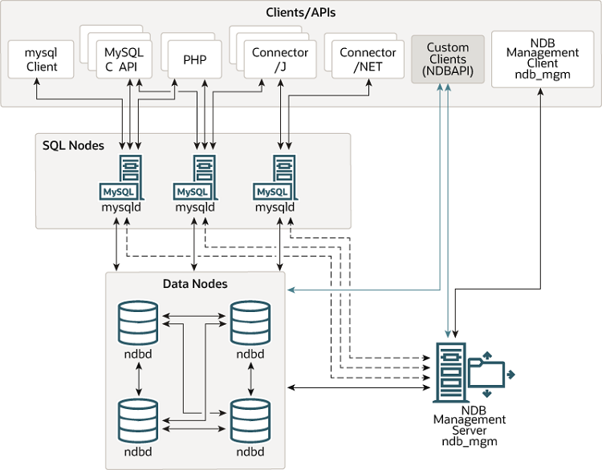

# NDB 集群概述

<https://dev.mysql.com/doc/refman/8.0/en/mysql-cluster-overview.html>

## 目录

[23.2.1 NDB 集群核心概念](NDB集群核心概念.md)
[23.2.2 NDB Cluster 节点、节点组、片段副本和分区](NDB节点和分区.md)
[23.2.3 NDB Cluster 硬件、软件和网络要求](NDB资源要求.md)
23.2.4 NDB Cluster 中的新增功能
23.2.5 NDB 8.0 中添加、弃用或删除的选项、变量和参数
[23.2.6 MySQL 服务器使用 InnoDB 与 NDB Cluster 比较](InnoDB与NDB的比较.md)
[23.2.7 NDB Cluster 的已知限制](NDB集群的已知限制/NDB集群的已知限制.md)

## 概述

NDB Cluster 是一种在无共享系统中启用内存数据库集群的技术。无共享架构使系统能够使用非常便宜的硬件，并且对硬件或软件的特定要求最低。

NDB Cluster 旨在没有任何单点故障。在无共享系统中，每个组件都应该有自己的内存和磁盘，不推荐也不支持使用网络共享、网络文件系统和 SAN 等共享存储机制。

NDB Cluster 将标准 MySQL 服务器与称为 NDB（代表“网络数据库”）的内存集群存储引擎集成在一起。在我们的文档中，术语 NDB 是指特定于存储引擎的设置部分，而“MySQL NDB Cluster”是指一个或多个 MySQL 服务器与 NDB 存储引擎的组合。

NDB Cluster 由一组称为主机的计算机组成，每台计算机运行一个或多个进程。这些称为节点的进程可能包括 MySQL 服务器（用于访问 NDB 数据）、数据节点（用于存储数据）、一个或多个管理服务器，以及可能的其他专用数据访问程序。 NDB Cluster 中这些组件的关系如下所示：

图 23.1 NDB 集群组件

在这个集群中，三个 MySQL 服务器（mysqld 程序）是 SQL 节点，提供对存储数据的四个数据节点（ndbd 程序）的访问。 SQL 节点和数据节点受 NDB 管理服务器（ndb_mgmd 程序）的控制。各种客户端和 API 可以与 SQL 节点交互 - mysql 客户端、MySQL C API、PHP、Connector/J 和 Connector/NET。还可以使用 NDB API 创建自定义客户端，以与数据节点或 NDB 管理服务器交互。 NDB 管理客户端（ndb_mgm 程序）与 NDB 管理服务器交互。

所有这些程序一起工作以形成 NDB Cluster（请参阅[第 23.5 节，“NDB Cluster 程序”](https://dev.mysql.com/doc/refman/8.0/en/mysql-cluster-programs.html))。当 NDB 存储引擎存储数据时，表（和表数据）存储在数据节点中。这些表可以直接访问来自集群中的所有其他 MySQL 服务器（SQL 节点）。因此，在集群中存储数据的工资单应用程序中，如果一个应用程序更新了员工的工资，所有其他查询该数据的 MySQL 服务器都可以立即看到此更改。

尽管 NDB Cluster SQL 节点使用 mysqld 服务器守护程序，但它在许多关键方面与 MySQL 8.0 发行版提供的 mysqld 二进制文件不同，并且 mysqld 的两个版本不可互换。

此外，未连接到 NDB Cluster 的 MySQL 服务器无法使用 NDB 存储引擎，也无法访问任何 NDB Cluster 数据。

存储在 NDB Cluster 的数据节点中的数据可以被镜像；集群可以处理单个数据节点的故障，除了少量事务由于丢失事务状态而中止之外没有其他影响。因为事务应用程序需要处理事务失败，所以这不应该是问题的根源。

单个节点可以停止和重新启动，然后可以重新加入系统（集群）。滚动重启（所有节点依次重启）用于进行配置更改和软件升级（请参阅[第 23.6.5 节，“执行 NDB 集群的滚动重启”](https://dev.mysql.com/doc/refman/8.0/en/mysql-cluster-rolling-restart.html)）。滚动重启也用作在线添加新数据节点的过程的一部分（请参阅[第 23.6.7 节，“在线添加 NDB Cluster 数据节点”](https://dev.mysql.com/doc/refman/8.0/en/mysql-cluster-online-add-node.html)）。有关数据节点、它们在 NDB Cluster 中的组织方式以及它们如何处理和存储 NDB Cluster 数据的更多信息，请参阅[第 23.2.2 节，“NDB Cluster 节点、节点组、片段副本和分区”](https://dev.mysql.com/doc/refman/8.0/en/mysql-cluster-nodes-groups.html)。

可以使用 NDB Cluster 管理客户端中的 NDB-native 功能和 NDB Cluster 发行版中包含的 ndb_restore 程序来备份和恢复 NDB Cluster 数据库。有关更多信息，请参阅[第 23.6.8 节，“NDB 集群的在线备份”](https://dev.mysql.com/doc/refman/8.0/en/mysql-cluster-backup.html)和[第 23.5.23 节，“ndb_restore - 恢复 NDB 集群备份”](https://dev.mysql.com/doc/refman/8.0/en/mysql-cluster-programs-ndb-restore.html)。您还可以在 mysqldump 和 MySQL 服务器中使用为此目的提供的标准 MySQL 功能。有关详细信息，请参阅[第 4.5.4 节，“mysqldump - 数据库备份程序”](https://dev.mysql.com/doc/refman/8.0/en/mysqldump.html)。

NDB Cluster 节点可以使用不同的传输机制进行节点间通信；在大多数实际部署中使用标准 100 Mbps 或更快以太网硬件上的 TCP/IP。
