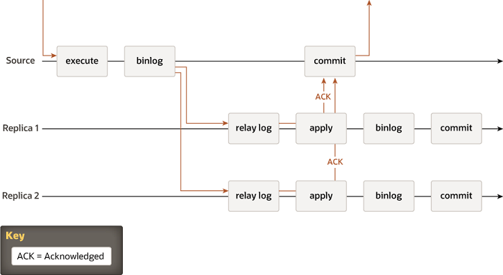

# 复制技术

18.1.1.1 源到副本复制
18.1.1.2 组复制

在深入了解 MySQL 组复制的细节之前，本节介绍一些背景概念和工作原理的概述。 这提供了一些上下文来帮助理解 Group Replication 所需的内容以及经典异步 MySQL Replication 和 Group Replication 之间的区别。

## 源到副本复制

传统的 MySQL 复制提供了一种简单的源到复制方法来复制。源是主，有一个或多个副本，即从属。源应用事务，提交它们，然后它们稍后（因此异步）发送到副本以重新执行（在基于语句的复制中）或应用（在基于行的复制中）。它是一个无共享系统，默认情况下所有服务器都拥有数据的完整副本。

源接收到的事务被执行，写入二进制日志，然后提交，并向客户端应用程序发送响应。在提交发生在源上之前，来自二进制日志的记录被发送到副本 1 和副本 2 上的中继日志。在每个副本上，应用事务、写入副本的二进制日志并提交。源上的提交和副本上的提交都是独立且异步的。

还有半同步复制，它在协议中增加了一个同步步骤。这意味着主节点在申请时等待辅助节点确认它已收到事务。只有这样，主节点才会恢复提交操作。

在两张图片中，有一个经典的异步 MySQL 复制协议（以及它的半同步变体）的图表。不同实例之间的箭头表示服务器之间交换的消息或服务器与客户端应用程序之间交换的消息。

## 组复制

组复制是一种可用于实现容错系统的技术。复制组是一组服务器，每个服务器都有自己的完整数据副本（无共享复制方案），并通过消息传递相互交互。通信层提供了一组保证，例如原子消息和全序消息传递。这些是非常强大的属性，可以转化为非常有用的抽象，人们可以借助这些抽象来构建更高级的数据库复制解决方案。

MySQL Group Replication 建立在这些属性和抽象之上，并实现了多源更新无处不在的复制协议。复制组由多台服务器组成，组中的每台服务器都可以随时独立执行事务。但是，所有读写事务只有在得到组批准后才会提交。换句话说，对于任何读写事务，组需要决定它是否提交，因此提交操作不是来自原始服务器的单方面决定。只读事务不需要在组内协调并立即提交。

当一个读写事务准备在源服务器上提交时，服务器会自动广播写入值（已更改的行）和相应的写入集（已更新行的唯一标识符）。因为事务是通过原子广播发送的，所以组中的所有服务器都接收到事务，或者没有。如果他们收到它，那么他们都以与之前发送的其他交易相同的顺序收到它。因此，所有服务器都以相同的顺序接收相同的事务集，并且为这些事务建立了全局总顺序。

但是，在不同服务器上同时执行的事务之间可能存在冲突。这种冲突是通过检查和比较两个不同的并发事务的写入集来检测的，这个过程称为认证。在认证期间，冲突检测在行级别进行：如果在不同服务器上执行的两个并发事务更新同一行，则存在冲突。冲突解决过程表明，首先订购的事务在所有服务器上提交，然后订购的事务第二次中止，因此在原始服务器上回滚并被组中的其他服务器丢弃。例如，如果 t1 和 t2 在不同的站点同时执行，都更改同一行，并且 t2 排序在 t1 之前，则 t2 赢得冲突，并且 t1 回滚。这实际上是一个分布式的首次提交获胜规则。请注意，如果两个事务肯定会经常发生冲突，那么最好在同一台服务器上启动它们，这样它们就有机会在本地锁管理器上同步，而不是因为认证而回滚.

为了应用和外部化已认证的事务，组复制允许服务器在不破坏一致性和有效性的情况下偏离约定的事务顺序。 Group Replication 是一个最终一致性系统，这意味着一旦传入流量变慢或停止，所有组成员都具有相同的数据内容。当流量流动时，交易可以以稍微不同的顺序外部化，或者在其他成员之前外部化。例如，在多主模式中，本地事务可能在认证后立即外部化，尽管尚未应用全局顺序中较早的远程事务。当认证过程确定交易之间没有冲突时，这是允许的。在单主模式下，在主服务器上，并发的、非冲突的本地事务可能以与 Group Replication 同意的全局顺序不同的顺序提交和外部化的可能性很小。在不接受来自客户端的写入的辅助节点上，事务总是按照约定的顺序提交和外部化。

下图描述了 MySQL 组复制协议，通过将其与 MySQL 复制（甚至 MySQL 半同步复制）进行比较，您可以看到一些差异。为了清楚起见，这张图片中缺少一些潜在的共识和 Paxos 相关的消息。

