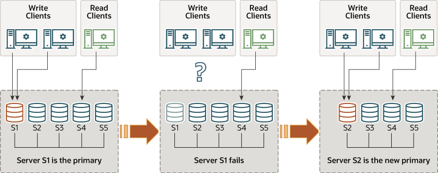

# 多主模式和单主模式

组复制以单主模式或多主模式运行。组的模式是组范围的配置设置，由 group_replication_single_primary_mode 系统变量指定，所有成员必须相同。 ON 表示单主模式，这是默认模式，OFF 表示多主模式。不可能以不同的模式部署组的成员，例如，一个成员配置为多主模式，而另一成员配置为单主模式。

当 Group Replication 正在运行时，您不能手动更改 group_replication_single_primary_mode 的值。从 MySQL 8.0.13 开始，您可以在 Group Replication 仍在运行时使用 group_replication_switch_to_single_primary_mode() 和 group_replication_switch_to_multi_primary_mode() 函数将组从一种模式移动到另一种模式。这些功能管理更改组模式的过程并确保数据的安全性和一致性。在早期版本中，要更改组的模式，您必须停止组复制并更改所有成员上的 group_replication_single_primary_mode 的值。然后执行组的完全重启（由 group_replication_bootstrap_group=ON 的服务器引导）以实现对新操作配置的更改。您不需要重新启动服务器。

无论部署模式如何，组复制都不处理客户端故障转移。这必须由 MySQL Router 8.0 等中间件框架、代理、连接器或应用程序本身来处理。

## 单主模式

在单主模式 (group_replication_single_primary_mode=ON) 中，组有一个设置为读写模式的主服务器。组中的所有其他成员都设置为只读模式（super_read_only=ON）。主服务器通常是引导组的第一台服务器。加入组的所有其他服务器了解主服务器并自动设置为只读模式。

在单主模式下，组复制强制只有单个服务器写入组，因此与多主模式相比，一致性检查可以不那么严格，并且不需要额外小心处理 DDL 语句。选项 group_replication_enforce_update_everywhere_checks 启用或禁用组的严格一致性检查。在单主模式下部署或将组更改为单主模式时，必须将此系统变量设置为 OFF。

指定为主服务器的成员可以通过以下方式进行更改：

- 如果现有的主节点离开组，无论是自愿还是意外，都会自动选出一个新的主节点。
- 您可以使用 group_replication_set_as_primary() 函数指定特定成员作为新的主要成员。
- 如果您使用 group_replication_switch_to_single_primary_mode() 函数将在多主模式下运行的组更改为在单主模式下运行，则会自动选择新的主节点，或者您可以通过函数指定新的主节点。

只有当所有组成员都运行 MySQL 8.0.13 或更高版本时，才能使用这些函数。当自动选举或手动指定新的主服务器时，它会自动设置为读写，其他组成员保持从属，因此是只读的。图 18.4，“新的初选”展示了这个过程。


五个服务器实例 S1、S2、S3、S4 和 S5 部署为一个互连组。服务器 S1 是主服务器。写客户端正在与服务器 S1 通信，而读客户端正在与服务器 S4 通信。然后服务器 S1 失败，中断与写入客户端的通信。然后服务器 S2 接管作为新的主服务器，写入客户端现在与服务器 S2 通信。

当一个新的主节点被选举或任命时，它可能会积压一些已应用于旧主节点但尚未应用于此服务器的更改。在这种情况下，在新的主节点赶上旧的主节点之前，读写事务可能会导致冲突并被回滚，而只读事务可能会导致读取过时。 Group Replication 的流控制机制可以最大限度地减少快速成员和慢速成员之间的差异，如果它被激活并正确调整，则可以减少发生这种情况的机会。有关流控制的更多信息，请参阅[第 18.7.2 节，“流控制”](https://dev.mysql.com/doc/refman/8.0/en/group-replication-flow-control.html)。从 MySQL 8.0.14 开始，您还可以使用 group_replication_consistency 系统变量来配置组的事务一致性级别以防止出现此问题。设置 BEFORE_ON_PRIMARY_FAILOVER（或任何更高的一致性级别）在新选择的主节点上保存新事务，直到应用了积压。有关事务一致性的更多信息，请参阅[第 18.5.3 节，“事务一致性保证”](https://dev.mysql.com/doc/refman/8.0/en/group-replication-consistency-guarantees.html)。如果组没有使用流控制和事务一致性保证，那么在将客户端应用程序重新路由到它之前，等待新的主节点应用其与复制相关的中继日志是一个很好的做法。

### 初选算法

自动主要成员选举过程涉及每个成员查看组的新视图，对潜在的新主要成员进行排序，并选择最合适的成员。每个成员根据其 MySQL 服务器版本中的主要选举算法在本地做出自己的决定。因为所有成员必须做出相同的决定，所以如果其他组成员运行较低的 MySQL Server 版本，成员会调整他们的主要选举算法，以便他们与组中具有最低 MySQL Server 版本的成员具有相同的行为。

成员在选举初选时考虑的因素依次如下：

1. 考虑的第一个因素是哪些成员或哪些成员正在运行最低的 MySQL 服务器版本。如果所有组成员都运行 MySQL 8.0.17 或更高版本，则成员首先按其发布的补丁版本排序。如果任何成员运行 MySQL Server 5.7 或 MySQL 8.0.16 或更低版本，则成员首先按其发布的主要版本排序，而补丁版本将被忽略。
2. 如果多个成员运行最低 MySQL 服务器版本，则考虑的第二个因素是每个成员的成员权重，由成员上的 group_replication_member_weight 系统变量指定。如果该组的任何成员正在运行 MySQL Server 5.7，而此系统变量不可用，则忽略此因素。
3. group_replication_member_weight 系统变量指定 0-100 范围内的数字。所有成员的默认权重为 50，因此将权重设置为低于此以降低其排序，将其设置为高于它的权重以增加其排序。您可以使用此加权函数来优先使用更好的硬件或确保在主节点的计划维护期间故障转移到特定成员。
4. 如果多个成员运行最低 MySQL 服务器版本，并且其中多个成员具有最高成员权重（或成员权重被忽略），则考虑的第三个因素是每个成员生成的服务器 UUID 的字典顺序，由 server_uuid 系统变量指定。具有最低服务器 UUID 的成员被选为主要成员。该因素充当有保证且可预测的决胜局，因此如果无法由任何重要因素决定，则所有小组成员都会做出相同的决定。

### 寻找初级Primary

要找出在单主模式下部署时哪个服务器当前是主服务器，请使用 performance_schema.replication_group_members 表中的 MEMBER_ROLE 列。 例如：

```sql
mysql> SELECT MEMBER_HOST, MEMBER_ROLE FROM performance_schema.replication_group_members;
+-------------------------+-------------+
| MEMBER_HOST             | MEMBER_ROLE |
+-------------------------+-------------+
| remote1.example.com     | PRIMARY     |
| remote2.example.com     | SECONDARY   |
| remote3.example.com     | SECONDARY   |
+-------------------------+-------------+
```

> 警告
group_replication_primary_member 状态变量已被弃用，并计划在未来版本中删除。

或者使用 group_replication_primary_member 状态变量。

`mysql> SHOW STATUS LIKE 'group_replication_primary_member'`

## 多主模式

在多主模式 (group_replication_single_primary_mode=OFF) 中，没有成员具有特殊角色。 任何与其他组成员兼容的成员在加入组时都设置为读写模式，并且可以处理写事务，即使它们是并发发出的。

如果成员停止接受写入事务，例如，在服务器意外退出的情况下，连接到它的客户端可以重定向或故障转移到处于读写模式的任何其他成员。 组复制本身不处理客户端故障转移，因此您需要使用中间件框架（例如 MySQL Router 8.0、代理、连接器或应用程序本身）来安排它。 图“客户端故障转移”显示了如果成员离开组，客户端如何重新连接到备用组成员。


组复制是一个最终一致性系统。这意味着一旦传入流量变慢或停止，所有组成员都具有相同的数据内容。当流量在流动时，事务可以先于其他成员在某些成员上进行外部化，特别是如果某些成员的写入吞吐量低于其他成员，从而产生过时读取的可能性。在多主模式下，速度较慢的成员还会积压过多的交易以进行认证和申请，从而导致更大的冲突和认证失败风险。为了限制这些问题，您可以激活和调整 Group Replication 的流量控制机制，以尽量减少快速和慢速成员之间的差异。有关流控制的更多信息，请参阅[第 18.7.2 节，“流控制”](https://dev.mysql.com/doc/refman/8.0/en/group-replication-flow-control.html)。

从 MySQL 8.0.14 开始，如果您想为组中的每个事务提供事务一致性保证，您可以使用 group_replication_consistency 系统变量来做到这一点。您可以选择适合您的组的工作负载和数据读取和写入优先级的设置，同时考虑提高一致性所需的同步对性能的影响。您还可以为各个会话设置系统变量，以保护对并发敏感的事务。有关事务一致性的更多信息，请参阅[第 18.5.3 节，“事务一致性保证”](https://dev.mysql.com/doc/refman/8.0/en/group-replication-consistency-guarantees.html)。

### 事务检查

当一个组以多主模式部署时，会检查事务以确保它们与该模式兼容。 以多主模式部署 Group Replication 时，会进行以下严格的一致性检查：

- 如果事务在 SERIALIZABLE 隔离级别下执行，则在与组同步时其提交失败。
- 如果事务针对具有具有级联约束的外键的表执行，则在与组同步时其提交失败。

检查由 group_replication_enforce_update_everywhere_checks 系统变量控制。 在多主模式下，系统变量通常应设置为 ON，但可以通过将系统变量设置为 OFF 来选择性地停用检查。 在单主模式下部署时，系统变量必须设置为 OFF。

### 数据定义语句

在多主模式下的 Group Replication 拓扑中，执行数据定义语句时需要小心，通常也称为数据定义语言 (DDL)。

MySQL 8.0 引入了对原子数据定义语言 (DDL) 语句的支持，其中完整的 DDL 语句作为单个原子事务提交或回滚。但是，DDL 语句，无论是原子的还是其他的，都会隐式结束当前会话中活动的任何事务，就好像您在执行语句之前已经完成了 COMMIT 一样。这意味着 DDL 语句不能在另一个事务中执行，不能在事务控制语句（如 START TRANSACTION ... COMMIT）中执行，也不能与同一事务中的其他语句组合。

组复制基于乐观复制范式(optimistic replication paradigm)，其中语句被乐观地执行并在必要时稍后回滚。每台服务器在没有首先获得组协议的情况下执行。因此，在多主模式下复制 DDL 语句时需要更加小心。如果您对同一对象进行模式更改（使用 DDL）和对象包含的数据的更改（使用 DML），则需要在模式操作尚未完成并在各处复制时通过同一服务器处理更改。当操作中断或仅部分完成时，不这样做可能会导致数据不一致。如果该组以单主模式部署，则不会发生此问题，因为所有更改都是通过同一台服务器（即主服务器）执行的。

有关 MySQL 8.0 中原子 DDL 支持的详细信息，以及某些语句复制的行为变化，请参阅[第 13.1.1 节，“原子数据定义语句支持”](https://dev.mysql.com/doc/refman/8.0/en/atomic-ddl.html)。

### 版本兼容性

为了获得最佳兼容性和性能，组的所有成员都应运行相同版本的 MySQL 服务器，因此也应运行相同的组复制。在多主模式下，这更重要，因为所有成员通常都会以读写模式加入组。如果一个组包含运行多个 MySQL 服务器版本的成员，则某些成员可能与其他成员不兼容，因为它们支持其他人不支持的功能，或者缺少其他人拥有的功能。为了防止这种情况发生，当新成员加入时（包括已升级和重新启动的前成员），该成员将对组的其余成员进行兼容性检查。

这些兼容性检查的一个结果在多主模式中尤为重要。如果加入的成员运行的 MySQL 服务器版本高于现有组成员运行的最低版本，它会加入组但保持只读模式。 （在以单主模式运行的组中，新添加的成员在任何情况下都默认为只读。）运行 MySQL 8.0.17 或更高版本的成员在检查其兼容性时会考虑发行版的补丁版本。运行 MySQL 8.0.16 或更低版本或 MySQL 5.7 的成员仅考虑主要版本。

在以多主模式运行且成员使用不同 MySQL Server 版本的组中，Group Replication 自动管理运行 MySQL 8.0.17 或更高版本的成员的读写和只读状态。如果成员离开组，运行现在最低版本的成员将自动设置为读写模式。当您将在单主模式下运行的组更改为在多主模式下运行时，使用 group_replication_switch_to_multi_primary_mode() 函数，组复制会自动将成员设置为正确的模式。如果成员运行的 MySQL 服务器版本高于组中存在的最低版本，则成员将自动置于只读模式，而运行最低版本的成员将置于读写模式。

有关组中版本兼容性以及升级过程中如何影响组行为的完整信息，请参阅[第 18.8.1 节，“在组中组合不同的成员版本”](https://dev.mysql.com/doc/refman/8.0/en/group-replication-online-upgrade-combining-versions.html)。